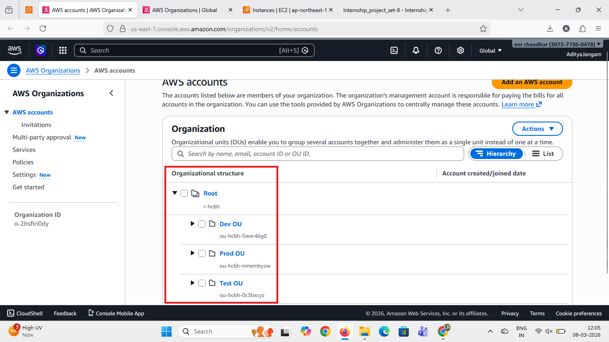
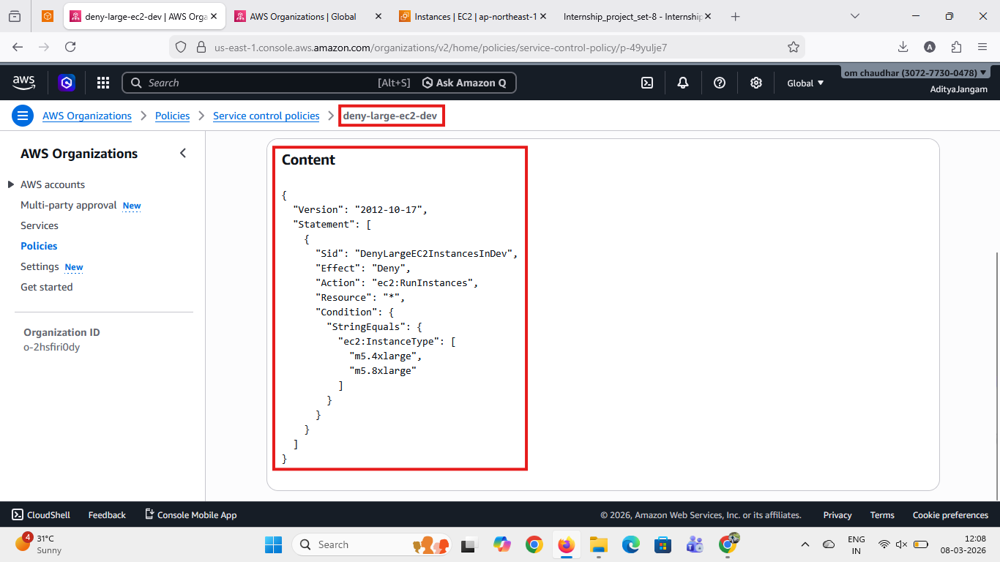
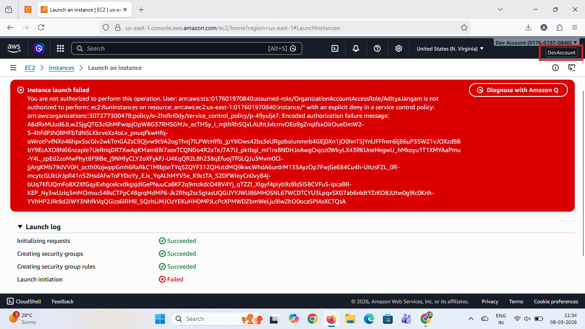
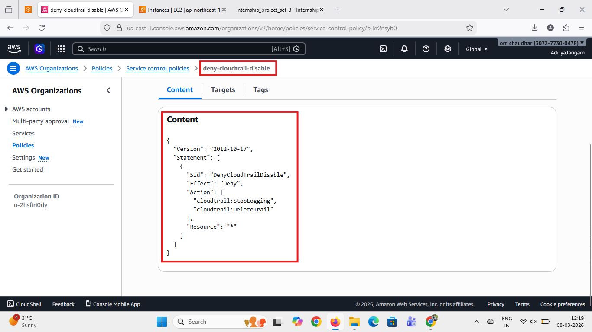
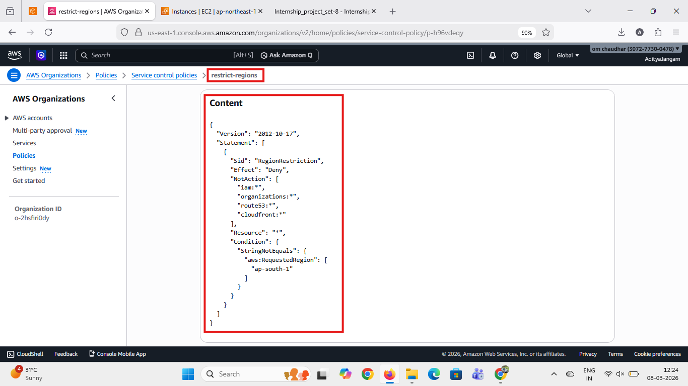
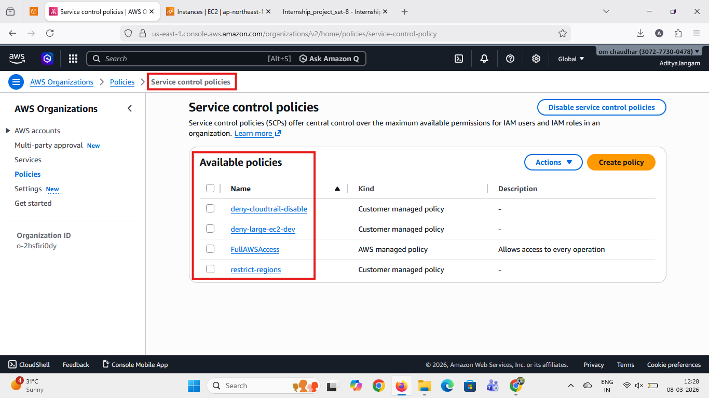
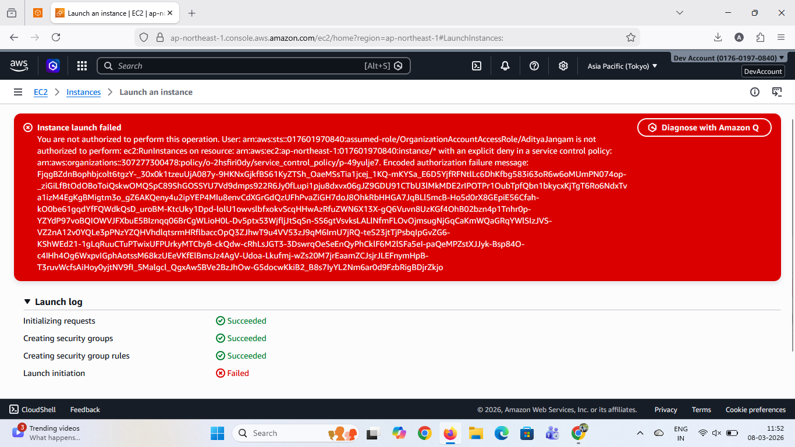

# AWS Organizations Governance Project

## Project Overview

This project demonstrates how to implement centralized governance across multiple AWS accounts using AWS Organizations and Service Control Policies (SCPs).

The objective of this project is to enforce security controls, restrict resource usage, and maintain governance across a multi-account AWS environment.

---

# Organization Structure

This screenshot shows the AWS Organization structure with multiple Organizational Units (OUs) such as Dev, Test, and Prod.

---

# Service Control Policies (SCP)

## 1. SCP Creation – Deny Large EC2 Instances

This policy restricts launching large EC2 instances in child accounts.

---

## 2. EC2 Launch Denied (Validation)

This screenshot verifies that launching restricted EC2 instance types is denied by the SCP.

---

## 3. CloudTrail Protection Policy

This policy prevents users from stopping logging or deleting CloudTrail.

---

## 4. Region Restriction Policy

This SCP restricts resource creation outside the allowed AWS region.

---

# Policies Attached to Root

This screenshot shows all Service Control Policies attached to the Root of the AWS Organization.

---

# Additional Policy Validation

This screenshot shows proof that the policy enforcement is working as expected.

---

# AWS Services Used

* AWS Organizations
* AWS IAM
* Amazon EC2
* AWS CloudTrail

---

# Key Learnings

* Multi-account governance using AWS Organizations
* Implementing security controls using SCPs
* Restricting AWS services and regions
* Protecting CloudTrail from unauthorized actions

---

# Conclusion

AWS Organizations and Service Control Policies provide centralized governance across multiple AWS accounts.

This project demonstrates how enterprises can enforce security policies, restrict resource usage, and maintain compliance in AWS environments.

---

⭐ This project is part of my AWS / DevOps learning journey.
